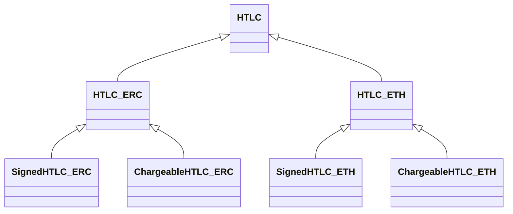
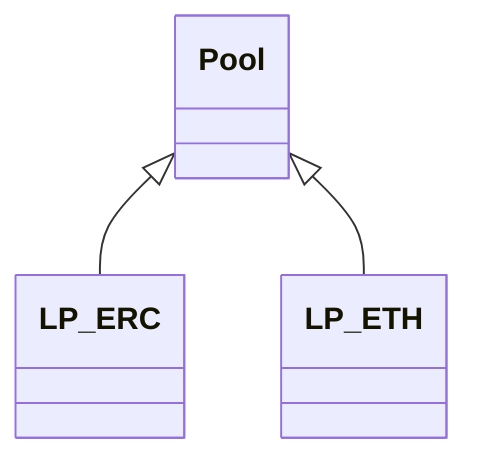

[](https://flutter.dev)

# AE Bridge

## Main features
- Bridge native tokens and ERC20 from EVM Blockchain (Ethereum, BSC, Polygon) to Archethic blockchain
- Bridge UCO and wrapped tokens from Archethic Blockchain to EVM Blockchain (Ethereum, BSC, Polygon)
- Refund

## Security
- Security access with your Archethic Wallet and EVM compatible wallet (Metamask, Brave, ...)

## Development

In order to develop and test the application, you need to have some prerequisites:

- [Ganache](https://trufflesuite.com/ganache/) (Simulation of the Ethereum's node)
- [Truffle](https://trufflesuite.com/docs/truffle/how-to/install/) (Tools for EVM smart contract development)
- [Node.js](https://nodejs.org/)
- [Flutter](https://flutter.dev/)
  - Flutter 3.10+
  - Dart 3+
- [Archethic node](https://github.com/archethic-foundation/archethic-node#running-a-node-for-development-purpose) (running in devnet mode)
- [Archethic Wallet](https://github.com/archethic-foundation/archethic-wallet) (Desktop version ie MacOS, Linux, Windows)
- EVM wallet ie Metamask, Brave, ...

### Steps

#### 1) Create an EVM Wallet
  - Launch Ganache and create a new workspace with network id 1337 (Server tab) and generate 10 accounts (Accounts & Keys tab)
  - Start your EVM wallet and import an account using the private key from the first workspace's account 
  - Click on "Key" icon in the first row on the Accounts tab
  - Copy the private key
  - Paste the private key into your EVM wallet
- Create an Archethic wallet
  - Start Archethic Node in the devnet environnment (ie local environnment)
  - Launch the Archethic Wallet
  - Create a new account in the devnet environnment
  - [Obtain UCO from the faucet for the account](http://localhost:4000/faucet)
  
#### 2) Deploy EVM Pools
  - Execute the following commands to deploy the contracts:
    ```bash
    cd truffle
    npm install -g truffle
    npm install
    truffle deploy
    ```
  - Configure the AEBridge project (`/lib/domain/repositories/tokens_list_per_bridge.json` file)
    - Put from terminal "info 2_deploy_eth_pool.js/TransparentUpgradeableProxy/contract address" value to "`-3->1337/ETH/poolAddressTo`"
    - Put from terminal "info 2_deploy_eth_pool.js/TransparentUpgradeableProxy/contract address" value to "`1337->-3/ETH/poolAddressFrom`"
    - Put from terminal "info 3_deploy_erc.pool.js/TransparentUpgradeableProxy/contract address" value to " `1337->-3/UCO/poolAddressFrom`"
    - Put from terminal "info 3_deploy_erc.pool.js/TransparentUpgradeableProxy/contract address" value to "`-3->1337/UCO/poolAddressTo}`"
    - Put from terminal "info 3_deploy_erc.pool.js/Deployed token" value to "`1337->-3/UCO/tokenAddress`"
    - Put from terminal "info 3_deploy_erc.pool.js/Deployed token" value to "`-3->1337/UCO/tokenAddress`"
    - Add ERC Token in your EVM Wallet
      - Put from terminal "info 3_deploy_erc.pool.js/Deployed token" value to EVM Wallet
  
#### 3) Deploy Archethic Pools
  - Execute the following commands to deploy the contracts
    ```bash
    cd ae_smart_contracts
    npm install
    node deploy_pool.js
    ```
    - If you encounter an "Insufficient funds" error:
      - [Obtain UCO tokens from the faucet for the Pool genesis address](http://localhost:4000/faucet) (with 300 UCO)
      - Retry deploying the contracts.

  - Configure the AEBridge project (`/lib/domain/repositories/tokens_list_per_bridge.json` file)
    - Put from terminal "Pool genesis address" value to `1337->-3/UCO/poolAddressTo`
    - Put from terminal "Pool genesis address" value to `-3->1337/UCO/poolAddressFrom`
  - [Obtain additional UCO tokens from the faucet for the Pool genesis address](http://localhost:4000/faucet)
  - Run AEBridge
    - Execute the following command at the project's root to launch the app with Chrome extension availability:
    ```bash
    flutter run -d web-server 
    ```  
  - Copy/Paste the app URL (ex: http://localhost:49316/) into Chrome 

## Note

*** This Application is currently in active development so it might fail to build. Please refer to issues or create new issues if you find any. Contributions are welcomed.

# Contracts management

## Truffle smart contracts

There are different kind of EVM smart contracts:
- HTLC contracts
- Liquidity pools

All the contract have their own type depending on the token used: native or ERC, because transfers/balance verification acts differently.

### HTLC contracts

Those contract provide the atomic swap logic.

There are few types 

- Signed: contract where a signature from the Archethic's pool is required to provision the contract or to withdraw funds
- Chargeable: contract where a fee is defined and in which the pool is assigning the recipient



### Liquidity pools contracts



### Development

You need to have [Truffle](https://trufflesuite.com/docs/truffle/) installed

To contribute, you need to go on the truffle directory 
```bash
cd truffle
```

For tests you can use unit tests:
```bash
truffle test
```

To use the pool in a local environment you can use migrations with:
```bash
truffle deploy
```

This will create two pools for ETH and ERC.
It will also create a dummy token, accessible via `LP_ERC.token()`

In order to test the signature from the LP Archethic pool you can use this tool to generate the signature:
```bash
node signing_tool.js 0x[DIGEST] 0x00d171013047636e2af5c7645377ed3e82f07d8ffe95a2aa65520306046be93f
```

The last parameter being the private key of the accounts[6] configured as the signer key in the migrations for the development network on Ganache

## Archethic Smart Contracts

There is three kind of SC:
- Factory contract
- HTLC contracts
- Pool contracts

### Factory contract

This contract is a helper for DApps UI and for Pool contracts to build and verify HTLC contracts. It also helps Pool contracts for minting new tokens.

Here is the public functions: 
- `get_chargeable_htlc(end_time, user_address, pool_address, secret_hash, token, amount)`  
It returns the code of a HTLC contract for fund going from EVM chain => Archethic
    - `end_time`: the limit timestamp for the swap
    - `user_address`: the destination address on Archethic
    - `pool_address`: the address of the Archethic pool to request funds
    - `secret_hash`: the hash of the secret generated by user
    - `token`: the token address to swap or "UCO"
    - `amount`: the amount of token the user wants to receive on Archethic

- `get_signed_htlc(end_time, user_address, pool_address, token, amount)`  
It returns the code of a HTLC contract for fund going from Archehtic => EVM chain
    - `end_time`: the limit timestamp for the swap
    - `user_address`: the user address on Archethic
    - `pool_address`: the address of the Archethic pool to request secret
    - `token`: the token address to swap or "UCO"
    - `amount`: the amount of token the user wants to receive on EVM chain

- `get_protocol_fee`  
It returns the protocol fees in percentage (0.3 => 0.3% = 0.003)

- `get_protocol_fee_address`  
It returns the address where the protocol fees are sent

### HTLC Contracts

Those contracts implement the logic of atomic swap. There is two types of contracts:
- Chargeable HTLC: used when swapping from EVM chain to Archethic.  
On creation, this contract needs to request funds to a pool. To do it the transaction that contains the code should also add the pool in the recipient with the parameters end_time, user_address, secret_hash, amount
- Signed HTLC: use when swapping from Archethic to EVM chain.  
On creation, this contrat needs to request a secret hash from a pool. To do it the transaction that contains the code should also add the pool in recipient with the parameters end_time, user_address, amount

### Pool Contracts

Those contract are responsible for creating new tokens and signing action to make a proof for EVM chain that actions has been done on Archethic.  
There is one contract version for token and one for UCO

### Script example

To help interaction with smart contracts, some helper scripts are available in js.  
A `config.js` file is provided to configure `poolSeed`, `userSeed`, `factorySeed` and `endpoint`.

#### deploy_pool.js
Used to deploy a pool.
```bash
node deploy_pool.js
```

#### deploy_chargeable_hltc.js
Used to deploy a chargeable HTLC for EVM chain => Archethic.  
Parameters:
- htlc_seed: the seed to use for deploying the htlc contract
- end_time: the limit time for the swap
- amount: the amount to receive from the pool
- secret_hash: the hash of the secret generated by user
```bash
node deploy_chargeable_hltc.js htlc1 1692394020 4 2cf24dba5fb0a30e26e83b2ac5b9e29e1b161e5c1fa7425e73043362938b9824
```

#### reveal_secret.js
Used to reveal the secret to a chargeable htlc.
Parameters:
- htlc_address: one address of the htlc contract chain (could be the genesis address)
- secret: the secret that has been used to create the contract
```bash
node reveal_secret.js 0000ec9c3a34e791bda21bbcb69ea0eb875857497e0d48c75771b3d1adb5073ce791 hello
```

#### deploy_signed_hltc.js
Used to deploy a signed HTLC for Archethic => EVM chain.  
Parameters:
- htlc_seed: the seed to use for deploying the htlc contract
- end_time: the limit time for the swap
- amount: the amount to receive from the pool
```bash
node deploy_signed_hltc.js htlc1 1692394020 4
```

#### request_secret.js
Used to request the secret to a pool for a signed htlc.
Parameters:
- htlc_genesis_address: the genesis_address of the htlc contract
```bash
node request_secret.js 0000ec9c3a34e791bda21bbcb69ea0eb875857497e0d48c75771b3d1adb5073ce791
```
 use the mnemonic test