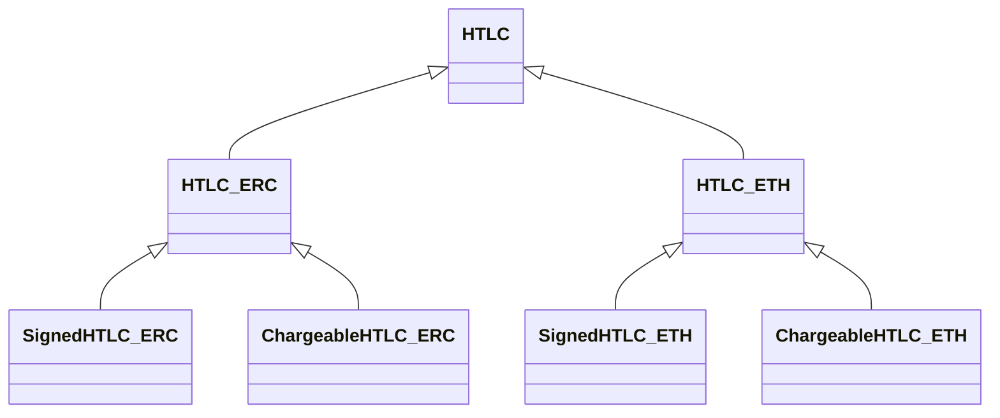
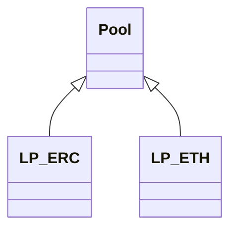

[](https://flutter.dev)

# AE Bridge

## Main features


## Security
- Security access with your Archethic Wallet

## Application Initial Screen

## Pre-requisites

- Flutter 3.10+
- Dart 3+

# Note

*** This Application is currently in active development so it might fail to build. Please refer to issues or create new issues if you find any. Contributions are welcomed.

## Truffle smart contracts

There are different kind of EVM smart contracts:
- HTLC contracts
- Liquidity pools

All the contract have their own type depending on the token used: native or ERC, because transfers/balance verification acts differently.

### HTLC contracts

Those contract provide the atomic swap logic.

There are few types 

- Signed: contract where a signature from the Archethic's pool is required to provision the contract or to withdraw funds
- Chargeable: contract where a fee is defined and in which the pool is assigning the recipient



### Liquidity pools contracts



### Development

You need to have [Truffle](https://trufflesuite.com/docs/truffle/) installed

To contribute, you need to go on the truffle directory 
```bash
cd truffle
```

For tests you can use unit tests:
```bash
truffle test
```

To use the pool in a local environment you can use migrations with:
```bash
truffle deploy
```

This will create two pools for ETH and ERC.
It will also create a dummy token, accessible via `LP_ERC.token()`


